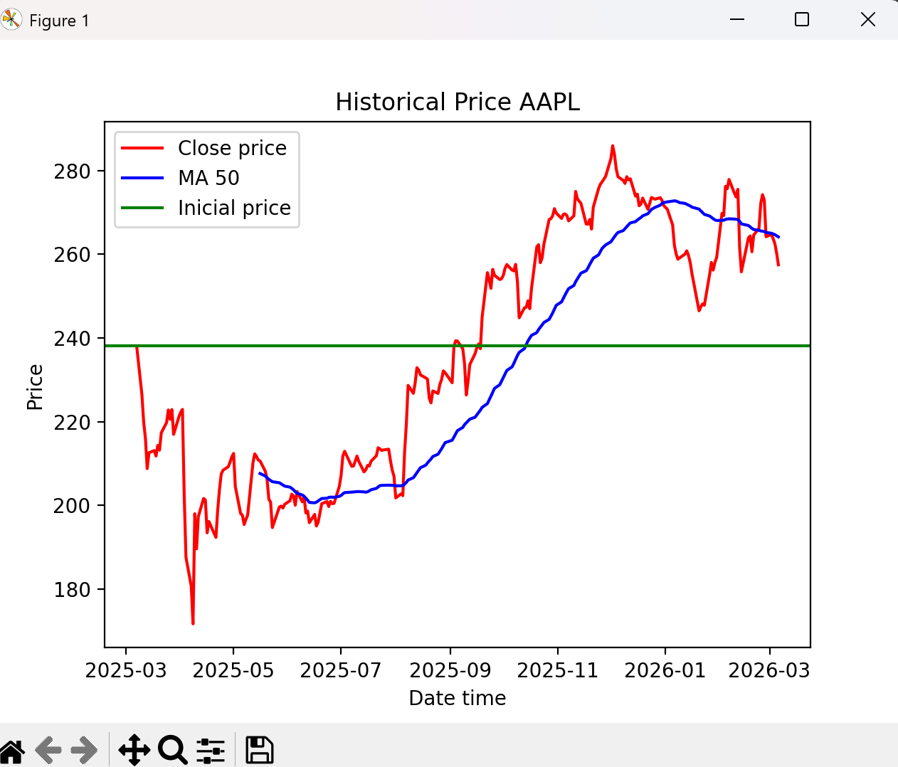

# Stock Analyzer

## Description
Project developed to quickly perform a simple analysis of stock market assets, 
through key financial metrics that show price evolution, comparisons, 
drawdowns and risk-adjusted return ratios. | WORK in progress | roadmap at the bott om 

## Technologies
The project has been fully developed in Python, using the following libraries:
NumPy, Pandas, yFinance and Matplotlib.

## Installation
Clone the repository, create a virtual environment and install the dependencies:

git clone https://github.com/RubenMC-44/stock-analyzer
cd stock-analyzer
Create a new virtual environment python -m venv "name"
pip install -r requirements.txt
python main.py

## Usage
The project must be launched from main.py. Once executed, it will prompt 
you to enter a ticker name (uppercase or lowercase is accepted). If the 
ticker is found in the database, the program will calculate and display 
all metrics along with a price history chart.

## Metrics

### Total Return --> 
Calculates the total percentage return of the asset over the entire period.
Formula: ((Last Price - First Price) / First Price) * 100
### Annualized Volatility -->
Calculates the annualized volatility based on daily price changes.
We assume 252 trading days in a year.
### Max Drawdown--> 
Calculates the Maximum Drawdown (MDD), which measures the largest peak-to-trough decline in the asset's value.
### Sharpe Ratio --> 
The Sharpe Ratio measures the excess return per unit of risk.
A higher Sharpe Ratio indicates that the asset provides better 
risk-adjusted returns without taking on excessive volatility

## Example Output --> 
--- AAPL Analysis---
Total return: 8.16%
Annualized volatility: 32.37%
Max Drawdown: -27.88%
Simplify Sharpe Ratio: 0.25

## Roadmap
This project is actively being developed. Planned features:

- [ ] Multi-ticker comparison
- [ ] Export results to CSV
- [ ] Drawdown history chart
- [ ] Price prediction with Machine Learning