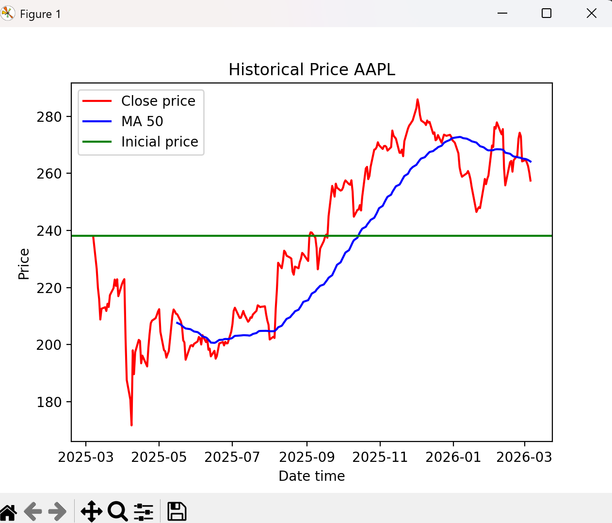

# Stock Analyzer
 
## Description
Project developed to quickly perform a multi-asset analysis of stock market assets, through key financial metrics that show price evolution, comparisons, drawdowns and risk-adjusted return ratios.
 
## Technologies
The project has been fully developed in Python, using the following libraries:
NumPy, Pandas, yFinance and Matplotlib.
 
## Installation
Clone the repository, create a virtual environment and install the dependencies:
 
```bash
git clone https://github.com/RubenMC-44/stock-analyzer
cd stock-analyzer
python -m venv venv
source venv/bin/activate  # On Windows: venv\Scripts\activate
pip install -r requirements.txt
python main.py
```
 
## Usage
The project must be launched from `main.py`. Once executed, it will prompt you to enter one or multiple ticker names separated by commas (uppercase or lowercase is accepted). For each valid ticker, the program will calculate and display all metrics, generate price history and drawdown charts, and export the results to a CSV file.
 
**Example input:**
```
Introduce the name of the active that you would like to analyze: AAPL, MSFT, GOOGL
```
 
## Metrics
 
### Total Return
Calculates the total percentage return of the asset over the entire period.
Formula: `((Last Price - First Price) / First Price) * 100`
 
### Annualized Volatility
Calculates the annualized volatility based on daily price changes.
Assumes 252 trading days in a year.
 
### Max Drawdown
Calculates the Maximum Drawdown (MDD), which measures the largest peak-to-trough decline in the asset's value. Also generates a full drawdown history chart showing how drawdown evolved over time.
 
### Sharpe Ratio
Measures the excess return per unit of risk. A higher Sharpe Ratio indicates better risk-adjusted returns without excessive volatility.
 
## Example Output
```
--- AAPL Analysis---
Total return: 30.36%
Annualized volatility: 23.35%
Max Drawdown: -13.80%
Simplify Sharpe Ratio: 1.30
```
 

 
A `Data_Tickers.csv` file is automatically generated after each run with the metrics of all analyzed tickers.
 
## Roadmap
- [x] Multi-ticker comparison
- [x] Drawdown history chart
- [x] Export results to CSV
- [ ] Streamlit dashboard
- [ ] Price prediction with Machine Learning
- [ ] Buy/Sell signals based on ML predictions