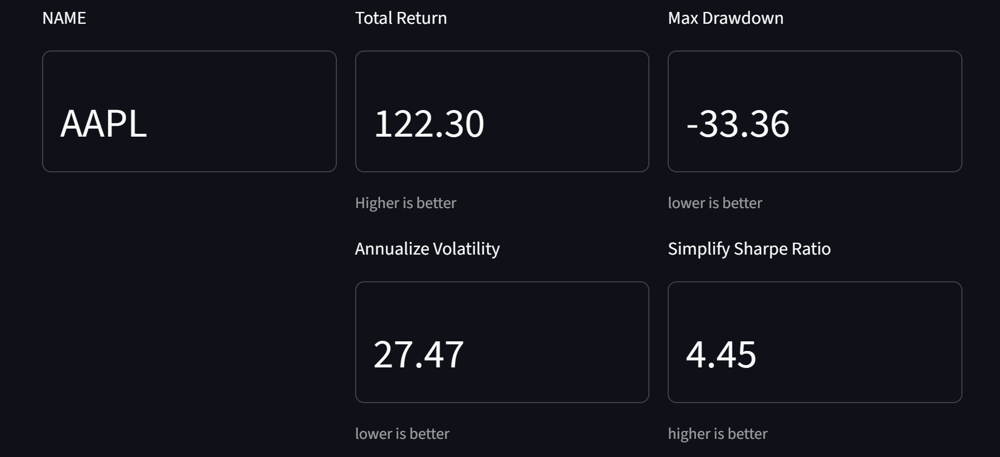
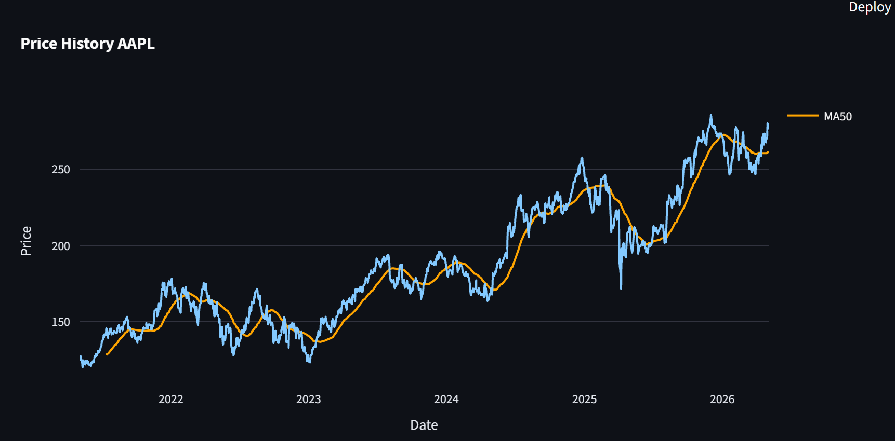
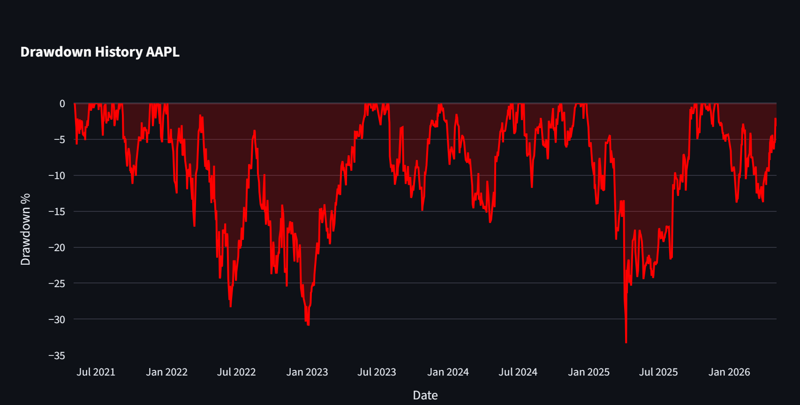
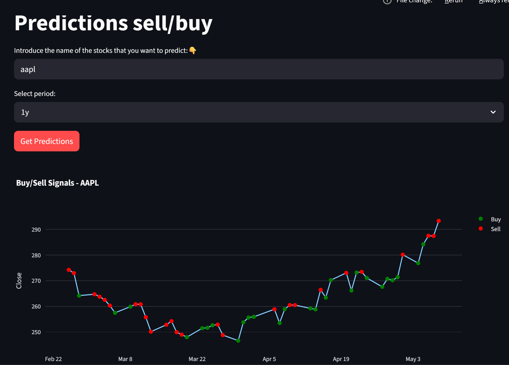

# Stock Analyzer
 
## Description
A multi-asset stock analysis tool built with Python and Streamlit. Analyzes financial metrics, visualizes price history and drawdowns, uses a Machine Learning model to generate buy/sell signals, and backtests the strategy against a simple buy & hold approach.
 
## Technologies
Python, Pandas, NumPy, yFinance, Scikit-learn, Plotly, Streamlit.
 
## Installation
Clone the repository, create a virtual environment and install the dependencies:
 
```bash
git clone https://github.com/RubenMC-44/stock-analyzer
cd stock-analyzer
python -m venv venv
source venv/bin/activate  # On Windows: venv\Scripts\activate
pip install -r requirements.txt
```
 
To launch the Streamlit dashboard:
```bash
streamlit run app.py
```
 
To run the terminal version:
```bash
python main.py
```
 
## Usage
Enter one or multiple ticker symbols separated by commas (uppercase or lowercase accepted). Select the analysis period (1y, 2y, 5y, 10y). The app has two pages:
 
**Data & Parameters** — displays key financial metrics, price history chart with 50-day moving average, and drawdown history chart for each ticker. Results can be exported as CSV.
 
**AI Predictions** — enter a ticker to generate buy/sell signals based on a Random Forest model trained on technical indicators, and compare the strategy performance against buy & hold through a backtest.
 
**Example input:**
```
AAPL
```





```
```
 
## Metrics
 
### Total Return
Total percentage return over the entire period.
Formula: `((Last Price - First Price) / First Price) * 100`
 
### Annualized Volatility
Annualized volatility based on daily price changes. Assumes 252 trading days per year.
 
### Max Drawdown
Largest peak-to-trough decline in the asset's value. A full drawdown history chart is also generated.
 
### Sharpe Ratio
Excess return per unit of risk. Higher values indicate better risk-adjusted performance.
 
## Machine Learning Model
 
The AI Predictions page uses a **Random Forest Classifier** trained on historical data. Features used:
 
- MA50 — 50-day moving average
- MA200 — 200-day moving average
- RSI — 14-day Relative Strength Index
- Volume
The model predicts whether the next day's closing price will be higher (Buy) or lower (Sell) than today's. Signals are plotted on the price chart as green (Buy) and red (Sell) markers.
 
> Note: Predicting stock market direction is inherently uncertain. The model achieves ~50% accuracy, which reflects the difficulty of the task rather than a flaw in implementation. This is a starting point for further experimentation.
 
## Backtesting
 
The backtest simulates a $1000 investment following the model's signals and compares it against a simple buy & hold strategy over the same period:
 
- **Strategy Capital** — invested only on days where the model predicts a price increase (Signal = 1). Capital stays frozen on sell signals.
- **Buy & Hold Capital** — invested from day one and held throughout the entire period.
Both curves are plotted together to evaluate whether the ML strategy adds real value over passive investing.
 
## Project Structure
 
```
stock-analyzer/
├── app.py          # Streamlit dashboard
├── main.py         # Terminal entry point
├── data.py         # Data fetching with yfinance
├── metrics.py      # Financial metrics calculations
├── display.py      # Chart generation (Plotly)
├── model.py        # ML model and backtesting (Random Forest)
└── requirements.txt
```
 
## Roadmap
- [x] Multi-ticker comparison
- [x] Drawdown history chart
- [x] Export results to CSV
- [x] Streamlit dashboard
- [x] Price prediction with Machine Learning
- [x] Buy/Sell signals based on ML predictions
- [x] Backtesting of ML signals
- [ ] Additional technical indicators
